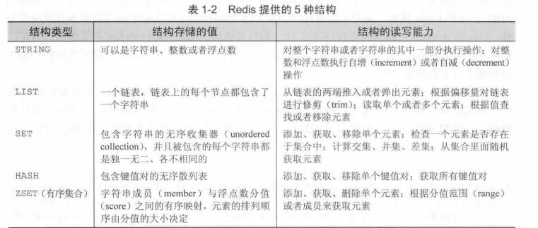
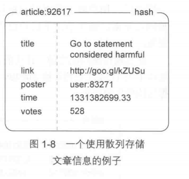
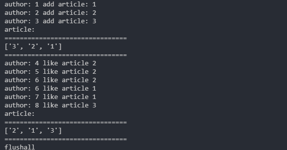

# Redis 第一章 

### Redis 数据结构

Redis 有5种数据结构分别为 STRING(字符串) LIST(列表) SET(集合) HASH(散列) ZSET(有序集合)  


  

#### STRING  

GET 获取存储在给定键中的值  
SET 设置存储在给定键中的值  
DEL 删除存储在给定键中的值 (这个命令可用于所有类型)  


```shell
127.0.0.1:6379> set hello world
OK
127.0.0.1:6379> get hello
"world"
127.0.0.1:6379> del hello
(integer) 1
127.0.0.1:6379> get hello
(nil)
```

#### LIST  

PRUSH 将给定值推入列表的右端  
LRANGE 获取列表在给定范围上的所有值  
LINDEX 获取列表在给定位置上的单个元素  
LPOP 从列表的左端弹出一个值, 并返回被弹出的值  

```shell
127.0.0.1:6379> rpush list-key item
(integer) 1
127.0.0.1:6379> rpush list-key item2
(integer) 2
127.0.0.1:6379> rpush list-key item
(integer) 3
127.0.0.1:6379> lrange list-key 0 -1
1) "item"
2) "item2"
3) "item"
127.0.0.1:6379> lindex list-key 2
"item"
127.0.0.1:6379> lindex list-key 1
"item2"
```

#### SET  

存储的字符串不是相同的  
但是是无序的  

SADD 添加到集合  
SREM 从集合中去除  
smembers
SMEMBERS 获取所有元素(如果元素很多会很慢)  
SISMEMBER 快速检测一个元素是否存在集合中

```shell
127.0.0.1:6379> sadd set-key item
(integer) 1
127.0.0.1:6379> sadd set-key item2
(integer) 1
127.0.0.1:6379> sadd set-key item3
(integer) 1
127.0.0.1:6379> sadd set-key item
(integer) 0
127.0.0.1:6379> smembers set-key
1) "item3"
2) "item2"
3) "item"
127.0.0.1:6379> sismember set-key item
(integer) 1
127.0.0.1:6379> srem set-key item
(integer) 1
127.0.0.1:6379> sismember set-key item
(integer) 0

```

#### 散列

存储多个键值对之间的映射  
存储的值即可以是字符串又可以是数字值  

HSET 添加
HGET 获取
HGETALL 获取所有  

```shell
127.0.0.1:6379> hset hash-key sub-key1 value1
(integer) 1
127.0.0.1:6379> hset hash-key sub-key2 value2
(integer) 1
127.0.0.1:6379> hset hash-key sub-key1 value1
(integer) 0
127.0.0.1:6379> hgetall hash-key
1) "sub-key1"
2) "value1"
3) "sub-key2"
4) "value2"
127.0.0.1:6379> hdel hash-key sub-key2
(integer) 1
127.0.0.1:6379> hgetall hash-key
1) "sub-key1"
2) "value1"
127.0.0.1:6379> hget hash-key sub-key1
"value1"
```

#### ZSET  

有序集合和散列一样 都用于存储键值对  
有序集合的键被称为成员 (member)  
每个成员都是各不相同的  
而有序集合的值则被称为分值 (score) 分值必须为浮点数 
可以根据分值以及分值的排列顺序来访问元素的结构  

ZADD 添加 
ZRANGE 获取元素 指定位置  
ZRANGEBYSCORE 指定分值条件获取元素  
ZREM 删除

```shell
127.0.0.1:6379> zadd zset-key 728 member1
(integer) 1
127.0.0.1:6379> zadd zset-key 982 member0
(integer) 1
127.0.0.1:6379> zadd zset-key 982 member0
(integer) 0
127.0.0.1:6379> zrange zset-key 0 -1 withscores
1) "member1"
2) "728"
3) "member0"
4) "982"
# 根据分值条件获取
127.0.0.1:6379> zrangebyscore zset-key 0 800 withscores
1) "member1"
2) "728"

# 删除
127.0.0.1:6379> zrem zset-key member1
(integer) 1
``` 

#### 对文章进行投票  

构建一个文章投票  
如果一篇文章获得至少200张支持票 那么网站就认为这篇文章是一篇有趣的文章 并将这些有趣的文章放到文章列表前100  
至少一天 并且这个网站不支持提供反对票  

要产生一个能够随着时间流逝而不断减少的评分 程序需要根据文章发布时间和当前时间来计算文章的评分  
具体计算: 将文章得到的支持票数乘以一个常量 然后加上文章的发布时间 得出的结果就是文章的评分  

这里的常量是432 这个常量是通过将一天的秒数(86400)除以文章展示一天所需的支持票数量(200)得出的 
文章每获得一张支持票 程序就需要将文章的评分增加432分  

这里还需存储网站上的各种信息  


  

使用冒号作为分隔符  例如: `article:92617` 大部分都是这样做前缀 还有 . /的  


这里用了两个有序集合来有序存储文章  
1. 键为文章的id 分值为 文章的发布时间
2. 键为文章的id 分值为 文章的评分  

通过这两个集合 可以根据文章发布的先后顺序展示 还可以根据文章的评分展示  


为防止用户对同一篇文章进行多次投票 网站对每篇文章记录一个已投票用户名单  
这样就创建一个集合 来存储投票的用户ID  

为了尽量节约内存 我们规定当一篇文章发布期满一周之后 用户将不能在对他进行投票 文章的评分会被固定下来  
对应的redis中的会被删除  


**逻辑**:  
用户投票时 先用ZSCORED命令检测记录文章发布时间的有序集合 判断文章的发布是否未超过一周  
if 还可以投票 -> SADD 将用户添加到记录文章已投票用户名单的集合里面  
并且使用 ZINCREBY 对文章的评分增加 432分  
并使用 HINCRBY 命令对散列记录的文章投票数量进行更新  


#### 发布文章  

发布文章需要有一个新的文章ID 使用计数器 执行 INCR命令来完成  
使用SADD 将文章发布者的ID添加到记录文章已投票用户名单里面 并使用 EXPIRE命令为这个集合设置一个国企时间  
让redis在文章发布期满一周之后自动删除这个集合  
使用 HMSET 命令来存储文章的相关信息 ZADD 将文章的初始评分和发布时间分布添加到两个响应的有序集合  

#### 取出评分最高的以及最新发布的文章  

先使用ZREVRANGE命令取出多个文章ID 然后再对每个文章ID执行一次 HGETALL 命令来取出文章的详细信息  
在使用ZREVRANGE 命令的时候以 分值从大到小的排列顺序取出文章ID  


#### 对文章进行分组  
群组功能由两个部分组成 一个部分负责记录文章属于哪个群组, 另一部分负责取出群组里面的文章  
为了记录各个群组都保存了哪些文章, 网站需要为每个群组参加一个集合 并将所有同属一个群组的文章ID都记录到那个集合里面  
也就是说 每个群组都是一个集合, 集合里面存了文章ID  


Redis的ZINTERSTORE 命令可以接受多个集合和多个有序集合作为输入 找出所有同时存在于集合和有序集合里的成员  
并以几种不同的方式来合并这些成员的分值  
使用 ZINTERSTORE 命令选出相同成员中最大的那个分值作为交集成员的分值: 取决于所使用的排序选择 这些分值即可以是文章的评分也可以是文章的发布时间  

```python
# 有序集 mid_test
redis 127.0.0.1:6379> ZADD mid_test 70 "Li Lei"
(integer) 1
redis 127.0.0.1:6379> ZADD mid_test 70 "Han Meimei"
(integer) 1
redis 127.0.0.1:6379> ZADD mid_test 99.5 "Tom"
(integer) 1
 
# 另一个有序集 fin_test
redis 127.0.0.1:6379> ZADD fin_test 88 "Li Lei"
(integer) 1
redis 127.0.0.1:6379> ZADD fin_test 75 "Han Meimei"
(integer) 1
redis 127.0.0.1:6379> ZADD fin_test 99.5 "Tom"
(integer) 1
 127.0.0.1:6379> zadd fin_test 100 "Recar"
(integer) 1

# 交集
redis 127.0.0.1:6379> ZINTERSTORE sum_point 2 mid_test fin_test
(integer) 3
 
# 显示有序集内所有成员及其分数值
redis 127.0.0.1:6379> ZRANGE sum_point 0 -1 WITHSCORES     
1) "Han Meimei"
2) "145"
3) "Li Lei"
4) "158"
5) "Tom"
6) "199"
```

这样可以将两个合并到一起来计算 交集的计算 计算的是两个都有的  

执行 ZINTERSTORE 命令比较花时间 为了尽量减少redis的工作量 程序将这个命令的计算结果缓存60s  
有缓存的话读取缓存 没有的话再重新执行排序并存入缓存  


第一章就是这些 这里我们在写个python的代码实例来实现这个网站的点踩功能  

```python
#!/usr/bin/python
# coding=UTF-8
'''
@Author: recar
@Date: 2019-09-24 19:28:11
@LastEditTime: 2019-09-25 18:03:18
'''
from datetime import datetime
import redis
import time
import sys
reload(sys)
sys.setdefaultencoding('utf-8')

redis_server = "127.0.0.1"
redis_port = 6379

class Article(object):
    # 实现一个对于文章点赞点踩的功能  

    def  __init__(self):
        self.conn = self.get_connection()
        self.zset_article_by_time_key = "article_by_time"
        self.zset_article_by_like_key = "article_by_like"
        self.hash_article_prefix = "hash_info_article:"
        self.set_article_prefix = "set_author_like_article:"
        # 分值常量 一天s数/ 需要多少票认为是好的文章
        self.constantvalue = 86400 / 10

    def get_connection(self):
        connect = redis.Redis(host=redis_server, port=redis_port,db=0)
        return connect

    def add_article(self, article_id, title, author,connect):
        # 添加文章
        hash_key = self.hash_article_prefix + str(article_id)
        self.conn.hset(hash_key, "title", title)
        self.conn.hset(hash_key, "author", author)
        self.conn.hset(hash_key, "connect", connect)
        create_time = datetime.now().strftime('%Y-%m-%d %H:%M:%S')
        time_tuple = time.strptime(create_time, '%Y-%m-%d %H:%M:%S')
        timeStamp = time.mktime(time_tuple)
        self.conn.hset(hash_key, "create_time", create_time)
        # 这里要添加一个文章发布的基于时间的有序集合
        self.conn.zadd(self.zset_article_by_time_key, {article_id: timeStamp})
        # 创建一个对文章点赞的集合 防止一个人对文章多次点赞
        set_key = self.set_article_prefix + str(article_id)
        self.conn.sadd(set_key, author)
        # 创建一个对文章点赞数的有序集合 用于排序展示  初始都是0
        self.conn.zadd(self.zset_article_by_like_key, {article_id: 0})
        print("author: {0} add article: {1}".format(author, article_id))

    def like_article(self, article_id, author):
        # 文章被点赞 先判断这个用户是否已经对文章点过赞了 
        set_key = self.set_article_prefix + str(article_id)
        is_exists = self.conn.sismember(set_key, author)
        if is_exists:
            return 
        else:
            # 将用户添加到集合并 
            self.conn.sadd(set_key, author)
            #对文章有序集合like自增分值 
            self.conn.zincrby(self.zset_article_by_like_key, self.constantvalue, article_id)
            print("author: {0} like article {1}".format(author, article_id))

    def get_article_by_like_time(self):
        # 获取时间加文章点赞作为分值的排序
        self.conn.zinterstore("zset_like_time", 
            (self.zset_article_by_time_key, self.zset_article_by_like_key),
            aggregate="SUM"
        )
        print("article:")
        print("================================")
        print(self.conn.zrange("zset_like_time", 0, -1, desc=True))
        print("================================")

    def clear(self):
        for key in self.conn.keys():
            self.conn.delete(key)
        print("flushall")

def main():
    article  = Article()
    # 添加三篇文章
    article.add_article(1,"one",1,"111111111")
    article.add_article(2,"two",2,"222222222")
    article.add_article(3,"three",3,"3333333")

    # 先输出文章
    article.get_article_by_like_time()

    # 点赞
    article.like_article(2,4)
    article.like_article(2,5)
    article.like_article(2,6)

    article.like_article(1,6)
    article.like_article(1,7)

    article.like_article(3,8)
    # 输出文章排序
    article.get_article_by_like_time()

    article.clear()

if __name__ == "__main__":
    main()
```  

最后输出  

  
