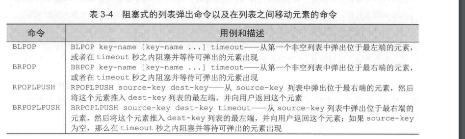
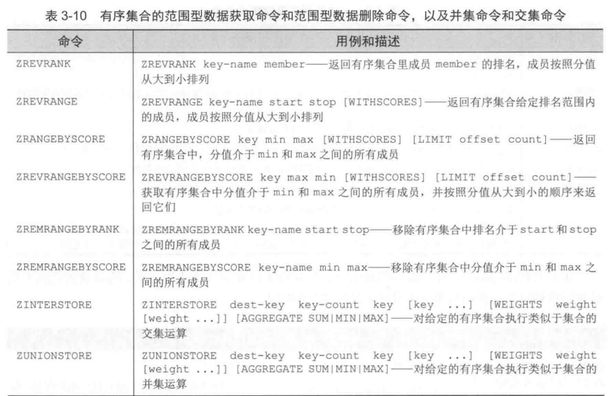

# 第三章

### Redis命令

#### 字符串
可以存储三种类型的值  
字节串  
整数  
浮点数  

用户可以通过给定一个任意的数值 对存储着整数或者浮点数的字符串执行自增(increment) 或者自减(decrement)  

如下图所示 自增自减命令  
  

如果用户对一个不存在的键或者一个保存了空串的键执行自增或者自减操作 那么Redis在执行操作时会将这个键的值当做0来处理  
如果用户尝试对一个值无法被解释为整数或者浮点数的字符串键执行自增或者自减的操作时 那么Redis将向用户返回一个错误  

```python
>>> import redis
>>> conn = redis.Redis()
# 取个不存在的就是空的
>>> conn.get('key')
>>> conn.incr('key')
1
# 设置自增步数为15
>>> conn.incr('key', 15)
16
>>> conn.decr('key', 5)
11
# 直接设置后 字符类型的也会解析为数字 然后可以直接 incr
>>> conn.set('key', '13')
True
>>> conn.incr('key')
14
>>>
```

Redis 对于处理子串和二进制位的命令  

  

在使用SERRANGE 或者 SETBIT命令对字符串进行写入的时候 如果字符串当前的长度不能满足写入的要求  
那么Redis会自动地使用空字节(null) 来将字符串扩展至所需的长度 然后才执行写入或者更新操作  

在使用GETRANGE读取字符串的时候 超出字符串末尾的数据会被视为空串  
而在使用GETBIT读取二进制位串的时候 超出字符串末尾的二进制会被视为0  

```python
>>> conn = redis.Redis()
>>> conn.append('new-string-key', 'hello ')
6L
>>> conn.append('new-string-key', 'world!')
12L
# 对于指定键的索引位置获取数据
>>> conn.substr('new-string-key', 3, 7)
'lo wo'
# 设置 指定键的指定索引位置的值
>>> conn.setrange('new-string-key', 0, 'H')
12
>>> conn.setrange('new-string-key', 6, 'W')
12
>>> conn.get('new-string-key')
'Hello World!'
# 可以直接在后面增加这个值
>>> conn.setrange('new-string-key', 11, ', how are you?')
25
>>> conn.get('new-string-key')
'Hello World, how are you?'
```

对超过字符串长度的二进制位进行设置时 超过的部分会别填充为空字节  
redis 存储的二进制位是按照偏移量从高到低排列的  

setbit key-name offset value是将字符串看作是二进制串 并将位串偏移的二进制位设置为value

```python
>>> conn.setbit('another-key', 2,1)
0
>>> conn.setbit('another-key', 7,1)
0
>>> conn.get('another-key')
'!'
```

先将第二个二进制位以及第七个二进制的值设置为1 那么这个值会是 '!' 是编码为33的字符  
因为默认的会用0填充 然后通过设置指定位的值为1 来实现  


#### 列表  

列表还可以用来存储任务信息、最近浏览过的文章 或者常用联系人信息  

  

```python
>>> conn.rpush('list-key', 'last')
1L
>>> conn.lpush('list-key', 'first')
2L
>>> conn.rpush('list-key', 'new last')
3L
>>> conn.lrange('list-key', 0, -1)
['first', 'last', 'new last']
# 从左侧弹出一个元素
>>> conn.lpop('list-key')
'first'
>>> conn.lpop('list-key')
'last'
>>> conn.lrange('list-key', 0, -1)
['new last']
# 可以一次传多个参数进行插入 *list 
>>> conn.rpush('list-key', 'a', 'b', 'c')
4L
>>> conn.lrange('list-key', 0, -1)
['new last', 'a', 'b', 'c']
# 可以指定删除左右两边任意的元素
>>> conn.ltrim('list-key', 2,-1)
True
>>> conn.lrange('list-key', 0, -1)
['b', 'c']
```

  

他可以在 timeout秒之内**阻塞**并等待可弹出的元素出现  


```python
>>> conn.rpush('list', 'item1')
1L
>>> conn.rpush('list', 'item2')
2L
>>> conn.rpush('list2', 'item3')
1L
>>> conn.brpoplpush('list2', 'list', 1)
'item3'
# 这里列表空了会等待指定的1s
>>> conn.brpoplpush('list2', 'list', 1)
# 这里列表空了会等待指定的2s
>>> conn.brpoplpush('list2', 'list', 2)
>>> conn.lrange('list', 0, -1)
['item3', 'item1', 'item2']
```

**blpop** 可以传入多个 每次将第一个非空的元素弹出  

```python
>>> conn.brpoplpush('list', 'list2', 1)
'item2'
>>> conn.lrange('list2', 0, -1)
['item2']
>>> conn.blpop(['list', 'list2'], 1)
('list', 'item3')
>>> conn.blpop(['list', 'list2'], 1)
('list', 'item1')
>>> conn.blpop(['list', 'list2'], 1)
('list2', 'item2')
>>> conn.blpop(['list', 'list2'], 1)
```

对于阻塞弹出命令和弹出并推入命令 最常见的用例就是 消息传递 和任务队列  

列表的一个优点在于他可以包含多个字符串值 这使得用户可以将元素集中在同一个地方  

#### 集合

  

竟然还有 SPOP 随机取出集合里的一个元素  


  

  

并集交集等操作  

```python
>>> conn.sadd('sky1', 'a', 'b', 'c', 'd')
4
>>> conn.sadd('sky2', 'c', 'd', 'e', 'f')
4
# 第一个集合有第二个集合没有的元素
>>> conn.sdiff('sky1', 'sky2')
set(['a', 'b'])
>>>
# 两个集合交集
>>> conn.sinter('sky1', 'sky2')
set(['c', 'd'])
# 两个集合并集
>>> conn.sunion('sky1', 'sky2')
set(['a', 'c', 'b', 'e', 'd', 'f'])
```

#### 散列

  


```python
# 可以一次插入多个 插入的是字典的形式
>>> conn.hmset('hash-key', {'k1': 'v1', 'k2': 'v3', 'k3': 'v3'})
True
# 可以取多个键的值
>>> conn.hmget('hash-key', ['k1', 'k2'])
['v1', 'v3']
>>> conn.hdel('hash-key', 'k1',k3)
>>> conn.hdel('hash-key', 'k1', 'k3')
2
```

散列一些高级命令  
  

如果存储的量特别大 可以先用 HKEYS 取出散列包含的所有键 然后再使用HGET 一个接一个的取出  


#### 有序集合 

可以根据分值大小有序的获取 (fetch) 或者扫描(scan) 成员和分值的命令  

  

第一章都写过了这里就不写了  

  

 交集的分数和
```python
>>> conn.zadd('zset-1', {'a': 1, 'b': 2, 'c': 3})
3
>>> conn.zadd('zset-2', {'b': 4, 'c': 1, 'd': 0})
3
>>> conn.zinterstore('zset-i', ['zset-1', 'zset-3'])
0L
>>> conn.zinterstore('zset-i', ['zset-1', 'zset-2'])
2L
>>> conn.zrange('zset-i', 0, -1, withscores=True)
[('c', 4.0), ('b', 6.0)]
```

取两个集合交集最小的与其他的元素的排序

```python
>>> conn.zunionstore('zset-u', ['zset-1', 'zset-2'], aggregate='min')
4L
>>> conn.zrange('zset-u', 0, -1, withscores=True)
[('d', 0.0), ('a', 1.0), ('c', 1.0), ('b', 2.0)]
```

#### 发布与订阅  

  

  


```python
SUBSCRIBE channel [channel ...] 订阅给定的一个或多个频道
UNSUBSCRIBE [channel [channel ..]] 退订给定的一个或多个频道 如果没有指定则退订所有频道
PUBLISH channel message 向给定频道发送消息
PSUBSCRIBE pattern [pattern ...] 订阅与给定模式相匹配的所有频道
PUNSUBSCRIBE [pattern [pattern ...]] 退订给定的模式 如果没有指定则退订所有模式
```

#### 发布订阅实例  

```python
#!/usr/bin/python
# coding=UTF-8
'''
@Author: recar
@Date: 2019-09-30 17:03:47
@LastEditTime: 2019-09-30 17:17:25
'''

import time
import threading
import redis

conn = redis.Redis(host="127.0.0.1", port=6379)

#  创建队列
def publisher(n):
    time.sleep(1)
    for i in xrange(n):
        # 发消息
        print('send message: {0}'.format(i))
        conn.publish('channel', i)
        time.sleep(2)
    print('send over')
# 打印消息 
def run_pubsub():
    threading.Thread(target=publisher, args=(5, )).start()
    pubsub = conn.pubsub()
    pubsub.subscribe('channel')
    count =0
    for item in pubsub.listen():
        print(item)
        count +=1
        if count == 4:
            # 退出订阅
            pubsub.unsubscribe()
        if count == 5:
            break

run_pubsub()

```
  

在开始订阅一个频道的时候 客户端会收到一个订阅反馈的消息  
退订的时候也会收到一个反馈消息  

然后就是其他的发送的消息了  

有消息积压而消耗过多内存问题  可靠的消息传递问题  
这样的有可能会丢失一小部分数据的风险  
需要更多的解决办法


#### 其他命令  

##### 排序 SORT  

```python
conn.rpush('sort-input', 23, 15, 110, 7)
# 根据 数字大写对元素进行排序
conn.sort('sort-input')
# 根据字母表顺序对元素进行排序
conn.sort('sort-input', alpha=True)

```

##### 事务

Redis 有5个命令可以让用户在不被打断的情况下对多个键执行操作  
WATCH MULTI EXEC UNWATCH DISCARD  

被以上命令包围的所有命令会一个接一个的执行  

要在Redis里执行命令 需要先执行 MULTI 命令 然后输入要执行的命令 最后执行 EXEC命令  

Redis事务在 python客户端上面是由流水线(pipline) 实现的 对连接对象调用 `pipline()`方法将创建一个事务  


没有事务  

```python
def notrans():
    print conn.incr('notrans')
    time.sleep(1)
    # 自减
    conn.incr('notrans', -1)
if True:
    for i in xrange(3):
        threading.Thread(target=notrans).start()
    time.sleep(5)

这样3个线程执行的命令会相互交错  
```

使用事务  

```python
def trans():
    pipline = conn.pipline()
    pipline.incr('trans:')
    time.sleep(1)
    # 直减操作放入队列
    pipline.incr('trans:', -1)
    # 执行
    print(pipline.execute()[0])
if True:
    for i in xrange(3):
        threading.Thread(target=notrans).start()
    time.sleep(5)  
```


##### 键的过期时间  

使用过期时间自动删除  

  


```python
>> conn.set('key', 'value')
True
>> conn.get('key')
'value'
# 设置过期时间
>> conn.expire('key', 2)
True
>> time.sleep(2)
>> conn.get('key')
```

