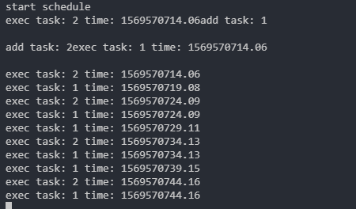

# Redis 第二章 

## 使用Redis构建Web应用  

这里假设的是一个大型网上商店 每天都会有大约500w 不同的用户 并且带来1亿次点击 并购买超过10w件商品  


### 使用Redis来管理用户登录会话  

首先使用一个散列来存储cookie令牌与已登录用户自己的映射 要检查一个用户是否已经登录 需要根据给定的令牌来查找与之对应的用户  
并在用户已经登录的情况下 返回该用户的ID  

##### 浏览商品 更新令牌  

用户每次浏览页面的时候 程序都会对用户存储在登录散列里面的信息进行更新 并将用户的令牌和当前时间戳添加到记录 最近登录用户的有序集合里  
如果用户正在浏览的是一个商品页面 那么程序还会将这个商品添加到记录这个用户最近浏览过的有序集合里面 并在被记录的数量超过25个的时候  
对这个有序集合进行修改 最大保持最近的25个商品  

即更新 tokne的时候把用户浏览的商品添加到有序集合中并使用 zremrangebyrank命令 移除旧的记录只保留最近流量的25个商品  

```python
def update_token(conn, token, user, item=None):
    timestamp = time.time()
    # 维持令牌与已登录用户之间的映射
    conn.hset('login', token, user)
    conn.zadd('recent', token, timestamp)
    if item:
        # 记录用户浏览过的商品
        conn.zadd('viewed:' + token, , item, timestamp)
        # 移除旧的记录 只暴力用户最近浏览过的25个商品
        conn.zremrangebyrank('viewed:'+ token, 0, -26)
```

但是随着时间推移数据量很大 我们需要定期清除旧的绘画数据 限制会话数据的数量 这里只保存最新的1000w个会话  

```python
QUIT = False
LIMIT = 10000000
def clean_sessions(conn):
    while not QUIT:
        # 获取目前令牌数量
        size = conn.zcard('recent:')
        if size <= LIMIT:
            time.sleep(1)
                continue
        # 每次先取出超过限制的数量再与100取最新的值作为结尾值
        end_index = min(size - LIMIT, 100)
        # 获取需要移除的令牌ID
        tokens = connn.zrange('recent:', 0, end_index-1)
        session_keys = []
        for token in tokens:
            session_keys.append('viewed:'+ token)
        # 批量删除
        conn.delete(*session_keys)
        conn.hdel('login:', *tokens)
        conn.zrem('recent:', *tokens))
```

会以守护进程或者定期任务的形式执行  

这里还讲了 python 接收可变数量参数的方式 上面的生成的 session_keys 是一个列表  
传给delete的时候直接 *session_keys 这样就会在里面解包 是delete的里面的具体写法才可以这样  
其实就是 *args 这个可变数量参数  


上述对于过期数据的处理 还可以使用 Redis的EXPIRE命令  
来设置集合的过期时间 但是这样就不能限制数量为一个范围了  

上面的代码中 有一个竞争条件 如果正在删除某个用户的信息 但是这个用户又在同一时间访问网站的话  
会导致用户信息删除 用户需要重新登录  

#### Redis实现购物车  

每个用户的购物车都是一个散列 这个散列存储了商品ID 与商品订购数量之间的映射 对商品数量进行验证的工作由web应用程序负责  
我们要做的是在商品的订购数量变化时 对购物车进行更新  
如果用户订购某件商品的数量大于0 那么程序会将这件商品的ID 以及用户订购该商品的数量添加到散列里面  
如果用户购买的商品已经存在于散列里面 那么新的订购会覆盖已有的订购数量
相反的 如果用户订购某件商品的数量不大于0 那么从散列里面移除该条目  

清除会话的时候把购物车一起清空  

#### 网页缓存  

很多页面不会改变 页面内容不需要动态生成 想办法不再生成这些页面 减少动态生成内容的时间  
所有标准的Python应用框架都提供了在处理请求之前或者之后添加层(layer) 的能力 这些层通常被称为 中间件或者插件  
我们将创建一个这样的层来调用Redis缓存函数  
对于一个不能被缓存的请求 函数将直接生成并返回页面 而对于可以被缓存的请求 函数首先会尝试从缓存中取出并返回被缓存的页面  
如果缓存不存在 那么函数会生成页面并将其缓存在Redis 里面5分钟 最后再将页面返回给函数调用者  

```python
def cache_request(conn, request, callback):
    # callback是生成页面的函数
    if not can_cache(conn, request):
        # 对于不能缓存的函数直接生成页面后返回
        return callback(request)
    # 将请求转换成一个简单的字符串键  
    page_key = 'cache:' + hash_request(request)
    content = conn.get(page_key)
    if not content: # 如果页面还没有被缓存 那么生成页面
        content = callback(request)
        conn.setex(page_key, content, 300) # 生成的页面放到缓存中
    return content
```

##### 数据行缓存  

促销活动  
这个活动每天都会推出一些特价商品供用户抢购 所有特价商品的数量都是限定的 卖完即止 在这种情况下 网站是不能对整个促销页面进行缓存的  
如果每次载入页面都从数据库里取出特价商品的剩余数量的话 会给数据库带来巨大的压力  

这里我们要对数据行进行缓存  

编写一个持续运行的守护进程函数 让整个函数将制定的数据行缓存到Redis里面 并不定期的读这些缓存进行更新 缓存函数会将数据行编码为JSON字典  
存储在Redis的字符串里面  数据列会被映射为键 `inv:273  {"a": 1}`  
程序使用了两个有序集合来记录应该在何时对缓存进行更新  
第一个有序集合为调度有序集合 他的成员为数据行的行ID 而分值则是一个时间戳 这个时间戳记录了一个个在何时将指定的数据行缓存到Redis里面  
第二个有序集合为延时(delay) 有序集合 他的成员也是数据行的行ID 而分值则是 这个数据行的缓存需要每隔多少秒更新一次  

为了让缓存函数定期的缓存数据行 程序首先需要将行ID和给定的延迟值添加到延迟有序集合里面 然后再将行ID和当前时间的时间戳添加到调度  
有序集合里面 实际执行缓存操作的函数需要用到数据行的延迟值 如果某个数据行的延迟值不存在 那么程序将取消对这个数据行的调度  
如果我们想要移除某个数据行已有的缓存 并且让缓存函数不再缓存那个数据行 那么只需要把那个数据行的延迟值设置为小于或者等于0  


负责调度缓存和终止缓存  

```python
def schedule_row_cache(conn, row_id, delay):
    # 先设置数据行的延迟值
    conn.zadd('delay:', row_id, delay)
    # 立即对需要缓存的数据行进行调度添加
    conn.zadd('schedule:', row_id, time.time())
```

如何进行缓存  
负责数据行的函数会尝试读取调度有序集合的第一个元素以及该元素的分值 如果调用有序集合没有包含任何元素 或者分值存储的时间戳所指定的  
时间未来临 那么先sleep 50ms 然后再检查  
当缓存函数发现一个需要立即进行更新的数据行时 缓存函数会检查这个数据行的延迟值:  
如果延迟值大于0的数据行来说 缓存函数会从数据库里面取出这些行 转为JSON 格式存储 并且更新这些行的调度时间  

```python
def cache_rows(conn):
    while not QUIT:
        # 尝试获取下一个需要被缓存的数据行以及该行的调度时间戳 返回一个包含0个或者一个元组的列表
        next = conn.zrange('schedule:', 0, 0, withscores=True)
        now = time.time()
        if not next or next[0][1] > now: # 时间没到或者0
            time.sleep(0.05)
            continue
        row_id = next[0][0]
        # 提前获取下一次调度的延迟时间
        delay = conn.zscore('delay:', row_id)
        if datetime <=0:
            # 不必再缓存这个行 从缓存中删除  
            conn.zrem('delay:', row_id)
            conn.zrem('schedule:', row_id)
            conn.delete('inv:', row_id)
            continue
        # 读取数据行
        row = Inventory.get(row_id)
        # 更新调度时间并设置缓存值
        conn.zadd('schedule:',row_id, now + delay)
        conn.set('inv:',row_id, json.dumps(row.to_dict()))
```

重复进行调度的自动缓存机制  

简单来说是这样的:  
两个有序集合 一个存储每次执行的间隔时间 一个存储下一次执行的时间 
每次判断下一次执行时间是否到了 到了就执行并删除当前调度获取间隔时间新插入新的调度 再次判断  


#### 网页分析  

不能对全部商品进行缓存 只对浏览量大的进行  
在 更新 token的时候对 浏览的商品进行计数统计  
以和这个商品的浏览次数进行排序 那么会两级分化  
为了让商品的浏览次数排行榜能保持最新 我们需要定期修剪有序集合的长度并调度已有元素的分值  
从而使得新流行的商品也可以在排行榜里面占据一席之地 通过 ZINTERSTORELai 来完成  

每隔5分钟 删除所有排名在2w后面的商品 并将剩下的所有商品的浏览次数减半  

然后根据商品的浏览次数排名来判断是否需要缓存这个页面  


在为应用程序构建新构件时 不要害怕回过头去重构已有的构件  
可能只是添加一些细微的修改来实现  

#### 调度实例代码

我们这里写下调度的实例代码  

```python
#!/usr/bin/python
# coding=UTF-8
'''
@Author: recar
@Date: 2019-09-27 11:37:22
@LastEditTime: 2019-09-27 15:48:43
'''

from datetime import datetime
from threading import Thread
import redis
import time
import sys
reload(sys)
sys.setdefaultencoding('utf-8')

redis_server = "127.0.0.1"
redis_port = 6379

class Scheduler(object):
    # 基于redis实现一个定时调度功能

    def  __init__(self, schedule=False):
        self.is_schedule = schedule
        self.conn = self.get_connection()
        self.zset_delay_key = "zset_delay:"
        self.zset_schedule_key = "zset_schedule:"
        if self.is_schedule:
            self.schedule()

    def get_connection(self):
        connect = redis.Redis(host=redis_server, port=redis_port,db=0)
        return connect

    def add_task(self, task_id, delay):
        # 添加时间间隔
        self.conn.zadd(self.zset_delay_key, {task_id: delay})
        # 添加调度任务 这个会要先生成一个立即调度的 
        self.conn.zadd(self.zset_schedule_key, {task_id: time.time()})
    
    def schedule(self):
        while True:
            next = self.conn.zrange(self.zset_schedule_key, 0, 0, withscores=True)
            now = time.time()
            # print(next)
            if not next or next[0][1] > now:
                # print('next: {0} -> now: {1}'.format(next[0][1], now))
                time.sleep(0.5)
                continue
            task_id = next[0][0]
            # 获取时间间隔
            delay = self.conn.zscore(self.zset_delay_key, task_id)
            # 如果更新了时间间隔 为0 那么都删除掉
            if delay <=0:
                self.conn.zrem(self.zset_delay_key, task_id)
                self.conn.zrem(self.zset_schedule_key, task_id)
                continue
            print('exec task: {0} time: {1}'.format(task_id, now))
            # 否则更新调度任务
            self.conn.zrem(self.zset_schedule_key, task_id)
            self.conn.zadd(self.zset_schedule_key, {task_id: now+delay})
def main():
    try:
        # 启动一个定时调度监控
        def statr_schedule():
            schedule = Scheduler(schedule=True)
        t = Thread(target=statr_schedule, args=())
        t.start()
        print('start schedule')
        schedule = Scheduler()
        schedule.add_task(1, 5)
        print('add task: {0}'.format(1))
        schedule.add_task(2, 10)
        print('add task: {}'.format(2))
    except Exception as e:
        print(e)
        exit(1)

if __name__ == "__main__":
    main()

```

输出  
  

添加任务就立即执行一次  
可以看到后续都是按时间来执行的  
