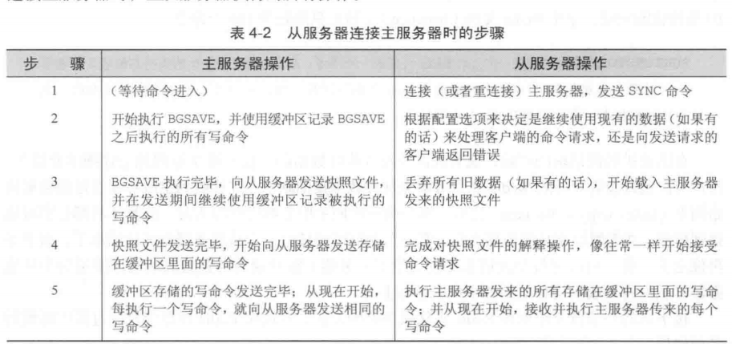
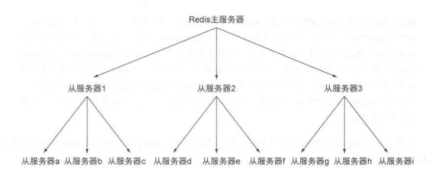
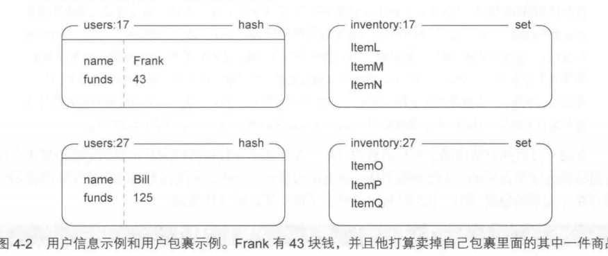
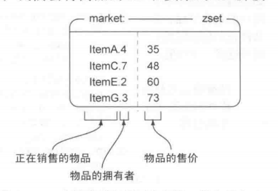
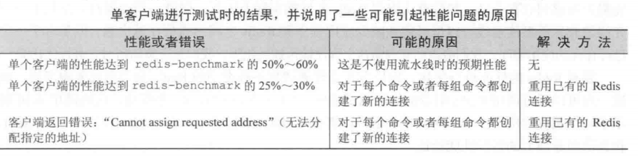

# 第四章 数据安全与性能保障

## 持久化选项

Redis 提供了两种不同的持久化方法来将数据存储到硬盘里面  
1. 快照 

他可以将存在于某一时刻的所有数据都写入硬盘里面
2. 只追加文件(AOF)

他会在执行命令时 将被执行的写命令复制到硬盘里面  

这两种持久化方法即可以同时使用又可以单独使用  

将内存中的数据存储到硬盘是为了之后重用数据  
或者是为了防止系统故障而将数据备份到一个远程位置  
存储在Redis的数据有可能是经过长时间计算出来的 如果aof 需要再重新计算  
有可能是数十亿行日志进行聚合分析得出的结果  


### 快照持久化

创建某个时间点上的副本 并且可以对快照进行备份 将快照复制到其他服务器  
从而创建具有相同数据的服务器副本 或者留在本地以便重启服务器时使用  

快照被写入 dbfilename选项指定的文件里面  

创建快照方法如下:
1. 客户端向Redis发送 `BGSAVE` 命令来创建一个快照 (windows平台不支持 因为是调用fork来写入)
2. 配置 `save 60 10000` 当60秒之内有10000次写入这个条件被满足时 redis会自动触发 BGSAVE 命令 (可以设置多个触发条件)
3. 当 Redis 通过 `SHUTDOWN` 命令接收到关闭服务器的请求时 或者接收到标准 TERM 信号时 会执行一个SAVE 命令 阻塞所有客户端 完成后关闭服务器
4. 当一个Redis 服务器连接另一个Redis服务器 并向对方发送SYNC命令来开始一次复制操作的时候 此时没有执行 BGSAVE并且也没有刚刚执行完 那么会执行 BGSAVE  

快照持久化只使用于那些即使丢失一部分数据也不会造成问题的程序  

`save 900 1` 的意思是: 每900s只要有一次写入就进行生成快照  

这个配置为什么这么配怎么配:  
如果丢失多久的数据是可以接受的 那么就配置多少  

当数据量很大的时候 创建快照的时间也很长 有可能BGSAVE  导致 系统长时间的停顿 从而导致 Redis性能降低  

为了防止 Redis因为创建子进行而出现停顿 我们可以考虑关闭自动保存 转而通过手动发送 BGSAVE 或者 SAVE 进行持久化  
也会挺淡但是可以控制停顿出现的时间 可以选择适合的时间进行 BGSAVE  

如果对于程序出现来说 丢失 15分钟或者1小时甚至生成时间不能接受 可以采用 AOF的方法持久化  


### AOF持久化

AOF持久化会将被执行的写命令写到AOF文件的末尾 以此来记录数据发送的变化  
Redis 只要执行一下AOF的所有写命令就恢复了  

appendfsync  同步频率  

always 每个Redis写命令都要同步写入硬盘 这样做会严重降低Redis的速度  
everysec 每秒执行一次同步 显示地将多个写命令同步到硬盘  
no 让操作系统来决定应该何时进行同步  

always 写的次数很多但是每次只写一个命令 某些情况下会降低固态硬盘的寿命  

Redis 每秒同步一次AOF文件的性能和不是要任何持久化特性时的性能相差无几  
最多丢失1s内产生的数据  当硬盘忙于执行写入操作的时候 Redis还会优雅的放慢自己的速度以便适应硬盘的最大写入速度  

### 重写/压缩AOF文件

随着运行 AOF文件不断增大 而且文件很大的话还原操作执行的时间也会很长  

用户可以向Redis 发送 `BGREWRITEAOF` 命令 这个命令会通过移除AOF文件中的冗余命令来重写 AOF文件  

AOF 设置自动执行 BGREWRITEAOF  
auto-aof-rewrite-percentage 100 比上一次大了100%  
auto-aof-rewrite-min-size  64mb 大于64MB  
这样的条件进行重写AOF文件  


### 复制

尽管有多个不同的选项可以控制从服务器自身的行为 但开启从服务器所必须的选项只有 slaveof 一个  
如果用户在启动 Redis 服务器的时候 指定了一个包含 slaveof host port 选项的配置文件 那么Redis 服务器将根据该选项给定的IP地址和端口号来连接主服务器  

#### Redis 复制的启动过程

  

将主服务器的快照发送到从服务器  
将主服务器的缓冲区的写命令发送给从服务器  
主服务器每次将写命令发送到从服务器  

Redis 处理命令请求的效率会收到影响 最好让主服务器只使用 50%~65%的内存 留下 30%~45%的内存用于执行 BGSAVE命令和创建记录写命令的缓冲区  


**设置从服务器**  
用户即可以通过配置选择 SLAVEOF host port 来将一个 Redis 服务器设置为从服务器  
还可以通过向运行中的Redis服务器发送 SLAVEOF 命令来将其设置为从服务器  

如果用户使用的是 **SLAVEOF 配置** 那么Redis 在启动时首先会**载入**当前可以用的任何快照文件 或者AOF文件 然后再如上图进行复制  

如果用户使用的是 **SLAVEOF 命令** 那么Redis 会**立即尝试连接主服务器** 连接成功后开始复制  

**注意:**  
从服务器在进行同步时 会清空自己的所有数据 替换成主服务器的数据  

不支持多主复制  

### 主从链

从服务器也可以拥有自己的从服务器 从而形成主从链  
从服务器对从服务器进行复制与主从唯一区别在于:  
如果从服务器x拥有从服务器y 那么当从服务器x在执行 完成对快速文件的解释操作 像往常一样开始接受命令请求 的
时 他将端口与从服务器y的连接 导致 从服务器y需要重新连接并重新同步  
当读请求的重要性明显高于写请求的重要性 并且读请求的数量远远超过一台Redis服务器可以处理的范围时  
欧诺个户就需要添加新的从服务器来处理读请求 随着负载不断上升 主服务器可能会无法快速的更新所有从服务器  
或者因为重新连接和重新同步从服务器而导致系统超载  
为了缓解这个问题 可以创建一个由Redis 主从节点 组成的中间层来分担主服务器的复制工作  

  
有三个从服务器来分担主服务器的复制工作  

同时使用复制和AOF持久化来将数据持久化到多台机器上面  

为了将数据保存到多台机器上面 用户首先需要为主服务设置多个从服务器 然后对每个从服务器设置 appendonly yes选项 和 appendfsync everysec 选项 (如果有需要的话 也可以对主服务器进行相同的设置) 这样的话 用户就可以让多台服务器以每秒一次的频率将数据同步到硬盘上了  


## 检验硬盘写入

为了验证主服务器是否已经将写数据发送至从服务器 用户需要在向主服务器写入真正的数据之后  
再向主服务器写入一个唯一的虚构值 (unique dummy value) 然后通过检查虚构值是否存在于  
从服务器来判断写数据是否已经到达从服务器  

对于每秒同步一次AOF文件的Redis服务器来说 用户总是可以通过等待1s来确保数据已经被保存到硬盘里  
但更节约时间的做法是 检查 INFO 命令的输出结果中 aof_pending_bio_fsync 属性的值是否为0  
如果是的话 那么就表示服务器已经把已知的所有数据都保存到硬盘里面了。  

检测函数  

```python
def wait_for_sync(mconn, sconn):
    # 将虚构值插入 主服务器
    identifier = str(uuid.uuid4())
    mconn.zadd('sync:wait', identifier, time.time())
    # 等待从服务器完成同步
    while not sconn.info()['master_link_status'] != 'up':
        time.sleep(0.001)
    # 等待从服务器接收数据更新
    while not sconn.zscore('sync:wait', identifier):
        time.sleep(0.001)
    deadline = time.time() + 1.0 # 最多只等待1s
    while time.time() < deadline:
        # 检测数据更新是否已经被同步到了硬盘
        if sconn.info()['aof_pending_bio_fsync'] == 0:
            break
        time.sleep(0.001)
    mconn.zrem('sync:wait', identifier)
    # 清理刚刚创建的 虚构值 以及之前可能留下的
    mconn.zremrangebyscore('sync:wait', 0, time.time(-900))

```

INFO命令提供了大量与Redis状态有关的信息  


## 处理系统故障


检验快照文件和AOF文件  

```shell
redis-check-aof [--fix] <file.aof>
redis-check-dummp <dummp.rdb>
```

redis-check-aof --fix 会对aof文件进行修复  
是在不正确或者不完整的命令 删除及之后的所有命令  

## 替换主服务器

就是主服务器挂了 然后原来的从服务器作为主服务器加一个从服务器  


## Redis事务

设计与和实现游戏商品买卖市场  

### 定义用户信息和用户包裹

用户信息存储在一个散列里面 散列的各个键值对分别记录了用户的姓名 用户拥有的钱数等属性  
用户包裹使用一个集合来表示 他记录了包裹里面每件商品的唯一编号  

  

商品买卖市场需求: 一个用户 (卖家) 可以将直接的商品按照给定的价格放到市场上进行销售  
当另一个用户 (买家) 购买这个商品时 卖家就会收到钱 另外 这里的市场只能按商品价格来排序  

为了将被销售商品的全部信息都存储在市场里面 将商品的ID和卖家的ID拼接起来  
并将拼接的结果用作成员存储到市场有序结合 并按价格排序  

  

### 将商品放到市场上销售

在将一件商品放到市场上进行销售的时候 程序需要将被销售的商品添加到记录市场正在销售商品的有序集合里  
并在添加操作执行的过程中 监视卖家的包裹以确保被销售的商品的确存在于卖家的包裹当中  

```python
def list_item(conn, itemid, sellerid, price):
    inventory = "inventory:%s" % sellerid
    item = "%s.%s" % (itemid, sellerid)
    end = time.time() + 5 
    pipe = conn.pipeline()
    while time.time() < end:
        try:
            pipe.watch(inventory) # 监视用户包裹发送的变化
            if not pipe.sismember(inventory, itemid):
                # 如果指定的商品u在用户的包裹里 那么停止对包裹的监控并返回一个空值
                pipe.unwatch()
                return None
            # 否则就添加到有序集合
            pipe.multi()
            pipe.zadd('market:', item, price)
            pipe.srem(inventory, itemid)
            pipe.execute()
            return True
        except redis.exceptions.WatchError:
            pass
        return False
    
```

### 购买商品  

程序首先使用 WATCH 对市场以及买家的个人信息进行监视 然后获取买家拥有的钱数以及商品的售价 并检查买家是否有 足够的钱来购买该商品 够的话 程序会将买家支付的钱转移给卖家  
然后将售出的商品移动至卖家的包裹 并在市场中移除 当卖家的个人信息或者商品买卖市场出现变化而导致 WatchError 异常出现 程序将进行重试 最大重试时间为10s  

```python
def purchase_item(conn, buyerid, itemid, sellerid, lprice):
    buyer = "users:%s" % buyerid
    seller = "users:%s" % sellerid
    item = "%s.%s" % (itemid, sellerid)
    inventory = "inventory:%s" % buyerid
    end = time.time() + 10
    pipe = conn.pipeline()
    # 对商品买卖市场以及买家的个人信息进行监控
    while time.time() < end:
        try:
            # 对商品买卖市场以及买家的个人信息进行监控
            pipe.watch("market:", buyer)
            price = pipe.zscore("market:" item)
            funds = int(pipe.hget(buyer, "funds"))
            # 买家能够买的起
            if price != lprice or price > funds:
                pipe.unwatch()
                return None
            pipe.multi()
            pipe.hincrby(seller, "funds", int(price))
            pipe.hincrby(buyer, "funds", int(-price))
            pipe.sadd(inventory, itemid)
            pipe.zrem("market:", item)
            pipe.execute()
            return True
        except redis.exceptions.WatchError:
            pass
        return False

```
需要对商品买卖市场以及买家的个人信息进行监视 确保商品还在  
监视买家是为了确保钱还够买  

redis没有实现典型的加锁功能 尽可能的减少客户端的等待时间  
Redis 只会在数据已经被其他客户端抢先修改了的情况下 通知执行了 WATCH 命令的客户端  
是乐观锁  
关系数据库实际执行的加锁操作是悲观锁  

### 非事务型流水线

```python
pipe = conn.pipeline(False)
# 后续正常
```
如果传入的True或者不传入任何参数 那么客户端将使用 MULTI和EXEC包裹起用户要执行的命令  
如果传入False  
那么还是会批量执行 但是不是要 MULTI和EXEC包裹要执行的这些命令  
对于一个命令的执行结果并不影响另一个命令的输入 而且不需要事务的话 使用False 可以提升性能  

### 性能方面的注意事项

`redis-benchmark`  

展示了一些常用Redis命令在1s内可以执行的次数  

不指定参数 默认使用 50个客户端来进行性能测试  


  

